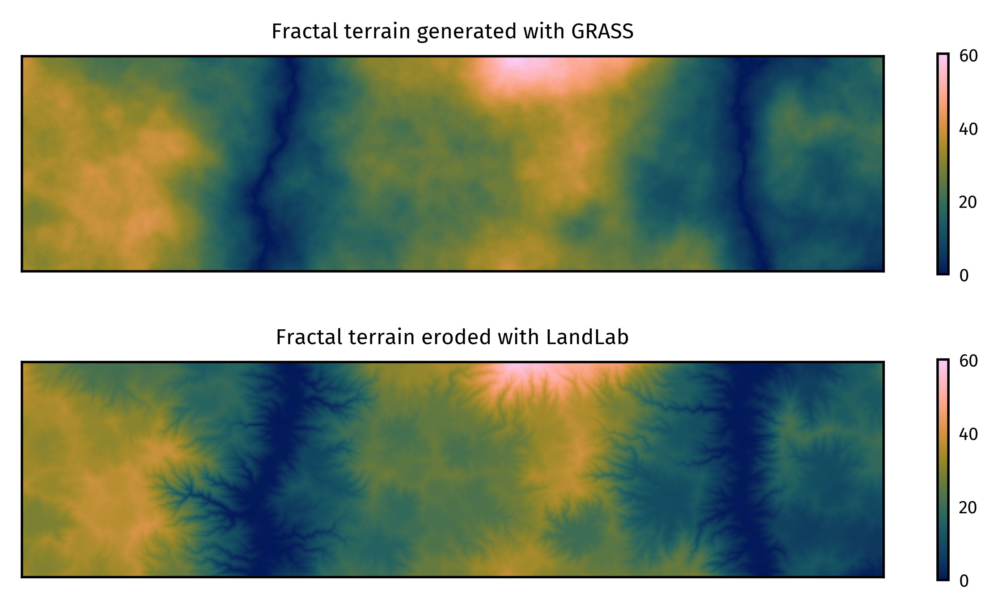

<!-- { width=100% } -->

<!-- Tutorials for the GRASS geocomputation engine -->
<!-- Growing the GRASS ecosystem: Tutorials for an open source geocomputation engine -->
<!-- Open learning resources for growing the GRASS ecosystem -->

# Summary

This collection of tutorials is an introduction 
to the GRASS geospatial processing engine. 
GRASS is an open source computational engine for 
spatiotemporal data management, analysis, modeling, and simulation 
[@GRASS].
As an engine that can be integrated in data science pipelines 
with shell scripting, Python, R, and Jupyter,
there are many ways to use GRASS. 
While GRASS already had extensive documentation, 
tutorials were needed to introduce the many ways to interface with GRASS. 
These open education tutorials - 
which cover integrations, core features, and disciplinary applications - 
were developed as part of an effort to grow the GRASS community.
The tutorials are released under both
the GNU Free Documentation License v1.2 or later and 
the Creative Commons Attribution-ShareAlike 4.0 International License.

# Statement of need

*Include a Statement of Need section, explaining how the submitted artifacts contribute to computationally enabled teaching and learning, and describing how they might be adopted by others.*

* Growing the GRASS ecosystem
  * GRASS has extensive documentation, but lacked official tutorials
    * Manual pages, api documentation, programming manual, etc.
    * Community developed tutorials
      * Not maintained by GRASS Dev Team
  * Introduction to GRASS as geospatial engine
    * Examples of how to interface with engine needed
      * GUI, CLI, Py, R, Cloud, Jupyter, etc.

<!-- The current roadmap for GRASS calls for 
new tutorials on introductory and advanced topics to encourage community growth and
new tutorials to demonstrate how the engine can be integrated into data science pipelines.  -->

# Description / Features

*Describe the learning objectives, content, instructional design, and experience of use in teaching and learning situations.*

## Learning Objectives

These tutorials were developed to teach
the fundamentals of geoprocessing with GRASS,
integrations of GRASS into data science pipelines, 
and disciplinary applications of GRASS. 
The tutorials were designed for self-study, 
integration into courses, 
and deployment in workshops.

## Instructional Design

* Design
  * Learning modules for self-study, classes, & workshops
  * Modular design for reuse and remixing
  * Scaffolded: getting started > core features > disciplinary topics
  * Interactivity for active learning
  * Worked examples for reduced cognitive load
  * Computational thinking with live coding
  * Scaffolding of explanations and code
* Audience
  * GRASS community of practice
    * Academics, professionals, & agencies
    * OSGeo Foundation
    * Broader FOSS4G community
  * Beginners to advanced
  * Self-learners: getting started tutorial series
* Mode
  * Online tutorials with computational notebooks
* Implementation, Infrastructure, & Deployment
  * Quarto > GitHub Pages
    * HTML pages & Jupyter notebooks

## Contents / Tutorials

<!-- official collection of tutorials maintained by the GRASS development team -->
<!-- also a curated collection of external tutorials from the GRASS community -->

| Modules     | Tutorials                                              | Level        | Language            |
|-------------|--------------------------------------------------------|--------------|---------------------|
| Get Started | Get started with GRASS GUI                             | Beginner     | English             |
|             | Get started with GRASS & Python in Jupyter Notebooks   | Beginner     | English             |
|             | Get started with GRASS in Google Colab                 | Beginner     | English             |
|             | Get started with GRASS in Jupyter Notebooks on Windows | Beginner     | English             |
|             | Get started with GRASS & R: the rgrass package         | Advanced     | English             |
| General     | Basics of map algebra                                  | Beginner     | English             |
|             | Making plots with GRASS                                | Beginner     | English             |
|             | Visualizing and modeling terrain from DEMs in GRASS    | Beginner     | English, Portuguese |
|             | Modeling Movement in GRASS                             | Advanced     | English, Portuguese |
|             | Introduction to remote sensing with GRASS              | Beginner     | English             |
|             | Procedural noise                                       | Intermediate | English             |
|             | Quick comparison: R and Python GRASS interfaces        | Intermediate | English             |
| Time series | Introduction to time series in GRASS                   | Intermediate | English             |
|             | Temporal subset, import and export                     | Intermediate | English             |
|             | Temporal aggregations                                  | Advanced     | English             |
|             | Temporal algebra                                       | Advanced     | English             |
|             | Temporal accumulation                                  | Advanced     | English             |
|             | Temporal gap-filling                                   | Advanced     | English             |
|             | Temporal query with vector data                        | Advanced     | English             |
| Earthworks  | Basic earthworks                                       | Beginner     | English             |
|             | Gully modeling                                         | Beginner     | English             |
|             | Coastal infrastructure                                 | Beginner     | English             |
|             | Terrain synthesis                                      | Intermediate | English             |

# Story

*Tell us the story of the project: how did it come to be?*

Please add to the story!

* Teaching experiences
  * HTML: NCSU Geospatial Modeling (MEAS582/GISXXX) [@Petras:2015]
  * Jupyter: NCSU Geospatial Computing and Simulation (GIS714) [@Haedrich:2023]

# Acknowledgements

The initial development of these tutorial was partially supported by the U.S. National Science Foundation under Grant [2303651](https://www.nsf.gov/awardsearch/showAward?AWD_ID=2303651).

# References