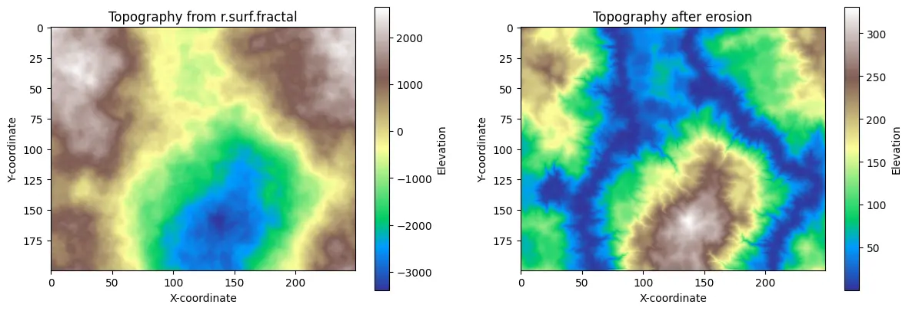

<!-- { width=100% } -->

# Summary

This collection of tutorials is an introduction to the GRASS geospatial processing engine. GRASS is an open source computational engine for spatiotemporal data management, analysis, modeling, and simulation [@GRASS; @Neteler:2008]. As an engine that can be integrated in data science pipelines with shell scripting, Python, R, Jupyter, and Colab, there are many ways to use GRASS.  While GRASS already had extensive documentation, tutorials were needed to introduce the many ways to interface with GRASS. These open education tutorials - which cover integrations, core features, and disciplinary applications - were developed as part of an effort to grow the GRASS community. The tutorials were built with Quarto and deployed as webpages paired with Jupyter computational notebooks. The tutorials are available at https://grass-tutorials.osgeo.org under both the GNU Free Documentation License v1.2 or later and the Creative Commons Attribution-ShareAlike 4.0 International License.

# Statement of Need

<!-- Include a Statement of Need section, explaining how the submitted artifacts contribute to computationally enabled teaching and learning, and describing how they might be adopted by others. -->

As GRASS has grown from its roots as a desktop geographic information system [@Westervelt:2004], it has evolved into a geocomputational engine with many interfaces. As an engine, it can be integrated in geospatial data science pipelines using shell scripting, application programming interfaces, tangible interfaces [@Petrasova:2018], computational notebooks [@Haedrich2023], cloud computing environments [@Neteler:2019], or high performance computing environments. While GRASS is well documented with user and developer manuals, it lacked official tutorials. Over the years, the community developed many tutorials, but as these are independently maintained, many have become outdated and obsolete. The current roadmap for GRASS – established in 2024 – calls for official new tutorials to encourage community growth and demonstrate integrations in data science pipelines. 

* Growing the GRASS ecosystem
  * GRASS has extensive documentation, but lacked official tutorials
    * Manual pages, api documentation, programming manual, etc.
    * Community developed tutorials
      * Not maintained by GRASS Dev Team
  * Current GRASS roadmap calls for new tutorials
    * Encourage community growth
    * Demonstrate integration  into data science pipelines
  * Introduction to GRASS as geospatial engine
    * Examples of how to interface with engine needed
      * GUI, CLI, Py, R, Cloud, Jupyter, etc.
  * Implementation based on teaching experiences
    * HTML: NCSU Geospatial Modeling (GIS/MEAS 582) [@Petras:2015]
    * HTML: NCSU UAS Mapping and Analysis (GIS/MEAS 584)
    * Jupyter: NCSU Geospatial Computing and Simulation (GIS714) [@Haedrich:2023]

# Description

<!-- Describe the learning objectives, content, instructional design, and experience of use in teaching and learning situations. -->

## Learning Objectives

These tutorials were developed to teach the fundamentals of geoprocessing with GRASS, integrations of GRASS into data science pipelines, and disciplinary applications of GRASS. The tutorials were designed for self-study by learners of all levels, integration into courses, and deployment in workshops.

## Instructional Design

The tutorials were designed to teach a computational approach to thinking about spatiotemporal phenomena through different interfaces to the GRASS engine. Drawing on the education benefits of computational notebooks [@Barba:2022], the tutorials were designed as modules for reuse and remixing, as worked examples to reduce cognitive load, as interactive lessons for active learning and engagement, as scaffolded prose and code to structure learning, and as computable content to teach computational thinking. The tutorials introduce geocomputational concepts through worked examples that synthesize prose explanations, graphics, and runnable code. The tutorials, which range from introductory to advanced, have a modular design for reuse and remixing so that learners can choose their own course of study and teachers can select modules for their lesson plans. The tutorials build in complexity from introductory to core to disciplinary modules. A set of getting started tutorials introduce different ways to interface with the GRASS engine. The core tutorials cover important concepts such as geovisualization, map algebra, geospatial modeling, and the temporal framework. Disciplinary tutorials demonstrate applications for GRASS in domains such as climatology, ecology, hydrology, geomorphology. The disciplinary tutorials build engagement by working through applications in the learner’s domain and thus motivate further exploration. Throughout the tutorials, different ways to interface with GRASS are presented as tabs in code blocks, so that learners can work their way through the same tutorial repeatedly using increasingly challenging interfaces – building proficiency first with the graphical user interface (GUI), then with the command line interface (CLI), and finally with the Python application programming interface (API).

## Implementation

This collection of tutorials was published using Quarto as web documents paired with computational notebooks. To reach a broad audience, the tutorials are published as web documents for immediate, easy access via web browsers. When appropriate, the web documents are accompanied by computational notebooks for the sake of interactivity, engagement, and geocomputational thinking. The tutorials – which are built and deployed using the Quarto scientific publishing system [@Quarto] – are written in Markdown with YAML frontmatter. Tutorials are composed in Markdown for human-readable source code, efficient version control, executable code blocks for different interfaces, rendering in multiple formats, and reproducibility. As this open education project aims to teach different ways to interface with GRASS, executable code for multiple relevant interfaces such as the GUI, CLI, Python, or R can be included in tutorials as tabsets. Once tutorials have been written, they are reviewed by the GRASS Development Team, rendered as web documents and Jupyter notebooks, and deployed to an Open Source Geospatial Foundation website. The source code for the tutorials is built in the GitHub repository https://github.com/OSGeo/grass-tutorials and deployed to the website https://grass-tutorials.osgeo.org using GitHub Actions. 

## Contents / Tutorials

This official collection of tutorials is maintained by the GRASS Development Team as part of the documentation for the GRASS geocomputational engine (\autoref{table:core}). This ensures that tutorials undergo rigorous review, tutorials are maintained and updated as GRASS evolves, and issues are promptly addressed. The website also includes a curated collection of community contributed tutorials that are hosted on external websites and maintained by their creators (\autoref{table:community}). 

: Official GRASS tutorials \label{table:core}

| Modules      | Tutorials                                              | Level        | Language |
|--------------|--------------------------------------------------------|--------------|----------|
| Integrations | Get started with GRASS GUI                             | Beginner     | En       |
|              | Get started with GRASS & Python in Jupyter Notebooks   | Beginner     | En       |
|              | Get started with GRASS in Google Colab                 | Beginner     | En       |
|              | Get started with GRASS in Jupyter Notebooks on Windows | Beginner     | En       |
|              | Get started with GRASS & R: the rgrass package         | Advanced     | En       |
| Core         | Basics of map algebra                                  | Beginner     | En       |
|              | Making plots with GRASS                                | Beginner     | En       |
|              | Visualizing and modeling terrain from DEMs in GRASS    | Beginner     | En & Pt  |
|              | Introduction to remote sensing with GRASS              | Beginner     | En       |
|              | Quick comparison: R and Python GRASS interfaces        | Intermediate | En       |
|              | Introduction to time series in GRASS                   | Intermediate | En       |
|              | Temporal subset, import and export                     | Intermediate | En       |
|              | Temporal aggregations                                  | Advanced     | En       |
|              | Temporal algebra                                       | Advanced     | En       |
|              | Temporal accumulation                                  | Advanced     | En       |
|              | Temporal gap-filling                                   | Advanced     | En       |
|              | Temporal query with vector data                        | Advanced     | En       |
|              | Modeling Movement in GRASS                             | Advanced     | En & Pt  |
| Disciplinary | Basic earthworks                                       | Beginner     | En       |
|              | Gully modeling                                         | Beginner     | En       |
|              | Coastal infrastructure                                 | Beginner     | En       |
|              | Terrain synthesis                                      | Intermediate | En       |
|              | Procedural noise                                       | Intermediate | En       |
|              | Hydro-flattening a Digital Elevation Model             | Intermediate | En       |

: Community contributed tutorials \label{table:community}

| Modules      | Tutorials                                                               | No. | Level                   | Language |
|--------------|-------------------------------------------------------------------------|-----|-------------------------|----------|
| Integrations | Unleash the power of GRASS GIS                                          | 5   | Beginner - Advanced     | En       |
|              | GRASS for Remote Sensing data processing with Jupyter Notebooks         | 1   | Advanced                | En       |
| Core         | NCSU Geospatial Modeling and Analysis Course                            | 13  | Beginner - Intermediate | En       |
|              | Geoprocessamento com GRASS GIS                                          | 1   | Beginner - Intermediate | Pt       |
|              | Tutoriales de GRASS GIS en grasswiki                                    | 4   | Beginner - Intermediate | Es       |
|              | GISMentors                                                              | 30  | Beginner - Advanced     | En & Cs  |
| Disciplinary | Deforestation study using GRASS GIS                                     | 1   | Beginner                | En       |
|              | Teledetección, OBIA y series de tiempo                                  | 5   | Beginner - Intermediate | Es       |
|              | GIS for Designers                                                       | 12  | Beginner - Intermediate | En       |
|              | GRASS GIS for environmental monitoring and disease ecology applications | 2   | Beginner - Intermediate | En       |
|              | Processing lidar and UAV point clouds                                   | 1   | Beginner - Intermediate | En       |
|              | Physically-based hydrologic modeling using GRASS GIS r.topmodel         | 1   | Intermediate            | En       |
|              | Spatio-temporal data handling and visualization                         | 1   | Intermediate            | En       |
|              | Ecodiv.earth tutorials                                                  | 16  | Beginner - Advanced     | En       |
|              | Urban growth modeling with FUTURES                                      | 1   | Advanced                | En       |

## Acknowledgements

The initial development of these tutorials was partially supported by the U.S. National Science Foundation under Grant [2303651](https://www.nsf.gov/awardsearch/showAward?AWD_ID=2303651).

## References
